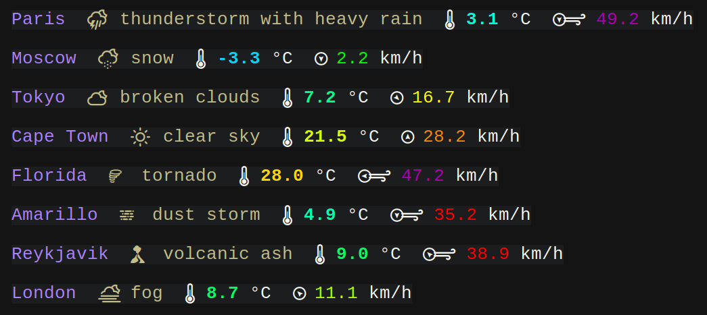
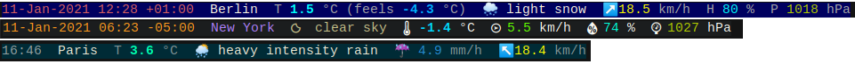

# girouette

**girouette** is a command line tool that displays the current weather (from [OpenWeather])
in the terminal.

It supports advanced fonts like Nerd Fonts with full color output:



And customizable output segments, including fallback to 16/256-color and simpler ASCII/Unicode support:



girouette requires an [OpenWeather API key] (free for 1 call per second). A default key is hard-coded for people to try things, but it will get rate limited quickly.

[![ci status][ci image]][ci link]

## Installation

Pre-compiled binaries are available on the [Release Page] for x86_64 Linux. They are statically linked and do not support the `geoclue` feature (no auto-geolocation).

If you are a **Fedora** (32+) user, you can install girouette with:

```sh
sudo dnf copr enable gourlaysama/girouette
sudo dnf install girouette
```

Otherwise you will need to [build from source](#building-from-source).

## Usage

Show the weather at a location:

```sh
$ girouette -l "Los Angeles"
$ girouette -l "35.68,139.69"
$ girouette -l auto  # if built with geoclue support (not available in static build)
```

The location can be set and the output customized in the [configuration file](#configuration).

## Building from source

girouette is written in Rust, so you need a [Rust install] to build it. girouette compiles with
Rust 1.48 or newer.

Building a dynamically-linked girouette (the default) also requires d-bus (for geolocalization support) and OpenSSL 
(`libdbus-1-dev` and `libssl-dev` on Ubuntu, `dbus-devel` and `openssl-devel` on Fedora).

Build the latest release (0.5.2) from source with:

```sh
$ git clone https://github.com/gourlaysama/girouette -b v0.5.2
$ cd girouette
$ cargo build --release
$ ./target/release/girouette --version
girouette 0.5.2
```

You can disable geolocation (and the need for d-bus and Geoclue) by building instead with:

```sh
$ cargo build --release --no-default-features --features dynamic
```

You can also build a fully static Linux binary using the musl libc. After installing musl 
(`musl-tools` on Ubuntu, `musl-libc-static` on Fedora), run:

```sh
$ rustup target add x86_64-unknown-linux-musl # run this only once
$ cargo build --release --no-default-features --features default-static --target x86_64-unknown-linux-musl
$ ./target/x86_64-unknown-linux-musl/release/girouette
```

## Options

```
-c, --cache <cache>          
        Cache responses for this long (e.g. "1m", "2 days 6h", "5 sec"), or `none` to
        disable it.

        If there is a cached response younger than the duration given as argument, it 
        is returned directly. Otherwise, it queries the API and write the response to
        the cache for use by a later invocation.

        NOTE: No response is written to the cache if this option isn't set. The
        invocation doing the caching and the one potentially querying it *both* need
        this option set.

        Recognized durations go from seconds ("seconds, second, sec, s") to
        years ("years, year, y"). This option overrides the corresponding value from
        the config.

    --config <config>        
        Use the specified configuration file instead of the default.

        By default, girouette looks for a configuration file:

        - on Linux in "$XDG_CONFIG_HOME/girouette/config.yml" or
          "$HOME/.config/girouette/config.yml"
        - on MacOS in "$HOME/Library/Application Support/rs.Girouette/config.yml"
        - on Windows in "%AppData%\Girouette\config\config.yml"

-k, --key <key>              
        OpenWeather API key (required for anything more than light testing).

        This option overrides the corresponding value from the config.

-L, --language <language>
        Use this language for location names and weather descriptions.

        This asks OpenWeather to provide location names and weather descriptions in
        the given language.

        Possible values are any 2-letter language code supported by OpenWeather, like
        "jp" (Japanese), "en" (English), "uk" (Ukrainian) or "zh_cn" (Chinese Simpl.).

-l, --location <location>    
        Location to query (required if not set in config).

        Possible values are: 
        * Location names: "London, UK", "Dubai"
        * Geographic coordinates (lat,lon): "35.68,139.69" This option overrides
          the corresponding value from the config.

    --clean-cache
        Removes all cached responses and exits.

        This empties the cache directory used when caching responses with "-c/--cache".

        By default, girouette puts the cache in:

        - on Linux in "$XDG_CACHE_HOME/girouette/results/" or
          "$HOME/.cache/girouette/results/"
        - on MacOS in "$HOME/Library/Caches/rs.Girouette/results/"
        - on Windows in "%AppData%\Girouette\cache\results\"

    --print-default-config    
        Prints the contents of the default configuration and exits.

-h, --help           
        Prints help information.

-V, --version        
        Prints version information.
```

## Configuration

### Configuration file location

girouette doesn't create a configuration file for you, but looks for it in the following locations:

* on Linux in `$XDG_CONFIG_HOME/girouette/config.yml` or `$HOME/.config/girouette/config.yml`
* on MacOS in `$HOME/Library/Application Support/rs.Girouette/config.yml`
* on Windows in `%AppData%\Girouette\config\config.yml`

The `--print-default-config` option displays the content of the default config. It can be use to initialize a custom configuration file:

```sh
$ girouette --print-default-config > myconfig.yml
```

### Global configuration keys

* `key` (string): the OpenWeather API key to use (can be overridden on the command-line with `-k/--key`). Registering a key is required for anything more than light testing.
* `location` (string): a default location to query (can be overridden on the command-line with `-l/--location`). 
  * If built with geolocation support (`geoclue` feature), can be `auto` or left empty to attempt geolocation.
  * Can be any name of a place.
  * Can be a tuple of latitude, longitude (e.g. `"35.68,139.69"`)
* `separator` (string): a separator string to use between segments. Defaults to two white-space characters `"  "`.
* `cache` (string): how long to cache responses from the API (can be overridden on the command-line with `-c/--cache`), or `none` to disable it.
  If there is a cached response younger than the duration given as argument, it is returned directly. Otherwise, it queries the API and write the response to the cache for use by a later invocation.
  NOTE: No response is written to the cache if this option isn't set. The invocation doing the caching and the one potentially querying it *both* need this option set.
  Recognized durations go from seconds ("seconds, second, sec, s") to years ("years, year, y").
* `language` (string): the language used for location and description segments. Possible values are any 2-letter code accepted by the OpenWeather API.


See the default configuration file [config.yml](config.yml) and browse the [example_configs](example_configs/) directory for examples (the example output shown above displays the default and both example configurations).

### Style configuration keys

* `base_style` (style): the default style for the whole output. This is used as the style to render the separator around the segments, and as the parent style for the segments themselves. Individual segments only need to override the specific things they want to change (e.g. the foreground color), leaving the rest intact.
* `display_mode` (string): what kind of characters to use in the output. Three values are possible:
  * `ascii`: only use ASCII characters. Icons will be very limited or even nonexistent. Will display fine on any terminal emulator.
  * `unicode`: use standard Unicode characters. This will use the somewhat limited list of weather-related icons in Unicode. This is the default.
    Note that most of these icons are emoji and their rendering in a terminal emulator will depend on the font, font fallbacks, and so on. Terminal emulators will also usually ignore the foreground color when emoji are not rendered "text-style".
  * `nerd_fonts`: use characters from the Nerd Fonts package. These provide the most specific and best-looking icons for weather, but the Nerd Font variant of your font must be [installed][Nerd Fonts] first (and your terminal emulator configured to use it).
* `segments` (list of segments): the list of information segments to display. Each segment contains an optional `style` attribute (described below) in addition to their own attributes.
  Available segments:
  * `instant`: the date/time of the weather measure. Has a single attribute:
    * `date_format` (string): how to format the date/time. Takes a [mostly C-style format][chrono format].
  * `location_name` (string): the location name from the weather measure. This isn't always the same as the queried location.
  * `temperature`: the temperature. The `style` attribute takes an additional `scaled` value to use an (hard-coded) color scale that varies with the temperature (this is the default). Has a two attributes:
    * `feels_like` (boolean): if yes, also displays the (estimated) felt-like temperature (takes into account wind/humidity/...).
    * `min_max` (boolean): if yes, also show the current local minimum and maximum temperatures. Those values give a range of the temperature around the queried area at the current moment. Defaults to false.
  * `weather_icon`: a single icon summarizing the weather.
  * `weather_description`: a textual description of the weather.
  * `rain`: the amount of falling rain (if any).
  * `snow`: the amount of falling snow (if any).
  * `wind_speed`: the measured wind speed.
  * `humidity`: the measured humidity.
  * `pressure`: the measured pressure.
  * `cloud_cover`: the overall fraction of the sky covered by clouds.

A style attribute is an object with 6 attributes, all optional:
* `bg` (color): the background color.
* `fg` (color): the foreground color.
* `bold` (boolean): if yes, render the text bold.
* `intense` (boolean): if yes, mark the text as intense. Terminal support varies.
* `underline` (boolean): if yes, mark the text as underlined. Terminal support varies.
* `italic` (boolean): if yes, mark the text as italic. Terminal support varies.

A color attribute used in styles can be either:
* a string containing a color name (black, blue, green, red, cyan, magenta, yellow, white),
* a integer between 0 and 255 representing an ANSI color code (e.g. `122`),
* a hexadecimal color code (e.g. `"#002b3f"`),
* a triple of integer representing an RGB color (e.g. `[15, 55, 84]`).

#### License

<sub>
girouette is licensed under either of <a href="LICENSE-APACHE">Apache License, Version 2.0</a> or <a href="LICENSE-MIT">MIT license</a> at your option.
</sub>

<br>

<sub>
Unless you explicitly state otherwise, any contribution intentionally submitted
for inclusion in girouette by you, as defined in the Apache-2.0 license, shall be
dual licensed as above, without any additional terms or conditions.
</sub>

[OpenWeather]: https://openweathermap.org
[OpenWeather API key]: https://openweathermap.org/appid
[Rust install]: https://www.rust-lang.org/tools/install
[Release Page]: https://github.com/gourlaysama/girouette/releases/latest
[ci image]: https://github.com/gourlaysama/girouette/workflows/Continuous%20integration/badge.svg?branch=master
[ci link]: https://github.com/gourlaysama/girouette/actions?query=workflow%3A%22Continuous+integration%22
[Nerd Fonts]: https://www.nerdfonts.com/
[chrono format]: https://docs.rs/chrono/0.4.19/chrono/format/strftime/index.html#specifiers